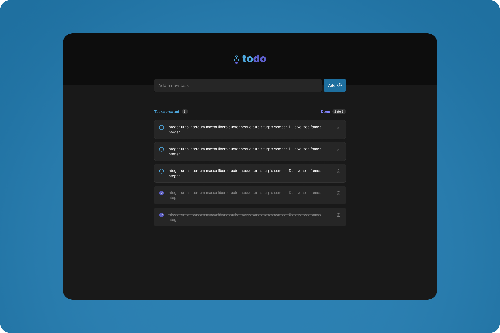

    

<h1 align="center">
	ToDo List App
</h1>

## 🚀 Project

A ToDo App to easily manage your tasks where you can create, delete and check them as you wish. 
Don't worry your data will be stored so you can keep focused on completing them even if you close or reload the app/webpage.

---

## 🔧 Technologies

- Vite
- ReactJS
- TypeScript

---

## 🧑‍💻 How to execute

- Clone the repository

- Run ' npm install '

- Run ' npm run dev ' and access the link that will apear on your terminal to open the project on your Browser

- And that's it, have fun :)

---

Made by <a href="https://twitter.com/RafaMartins_dev" target="_blank">Rafa Martins</a>
